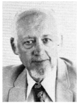

# Meteorological Satellite Laboratory Report 37, "Mesoscale Cellular Convection", by Lester F. Hubert

In May 1966, the U.S. Department of Commerce, Environmental Science Services Administration (predecessor to the modern [NOAA](https://www.noaa.gov/)), issued its Meteorological Satellite Laboratory Report number 37, titled "Mesoscale Cellular Convection".  Its author was a bureau research meteorologist in Washington, DC, Lester F. Hubert.  This report coined the terms "mesoscale cellular convection", "open cell", and "closed cell", in reference to the detection by the first U.S. weather satellite (TIROS I) of polygonal cloud patterns in the marine boundary layer by Krueger and Fritz (1961), and subsequent efforts at the Meterorological Satellite Laboratory, which were reviewed in the Hubert report.  (An earlier report of such phenomena, based on radar observations, was made by Reginald E. Newell in 1959.)  As in the earlier reports, Hubert posited a connection with classical Rayleigh-Benard convection studied in the laboratory, which had been speculated to have atmospheric analogs by numerous previous authors, including Henri Benard's students and associates.  Today mesoscale cellular convection (first abbreviated as "MCC" by Ernest M. Agee) is recognized as a special case of mesoscale shallow convection (MSC), which also includes roll pattern convection (Atkinson and Zhang, 1996).  A brief but informative historical perspective on these matters was given by Agee (1984); see also Kelly (1994).

Now of mainly historical value, the Hubert report does not appear to be readily available on the Internet.  In 1997 I obtained and photocopied the report via interlibrary loan from NOAA, and in 2025 (at great expense to myself) had it digitally scanned.  The purpose of this site is to make the report available on the internet.  Being a government report, it is copyright-free.  You may download it [here](hubert1966 mesoscale cellular convection.pdf).

## Lester F. Hubert

The author, "Les" Hubert, was born in 1913 in Minnesota and died in 2014.  He was a World War II veteran (Army Air Force), and a graduate of the University of Chicago, who worked for the U.S. Department of Commerce in various agencies considered predecessors to the modern NOAA.  He was known in particular for his work in satellite meteorology, tropical meteorology, among others.  He coauthored *Weather Satellites* with Paul E. Lehr (Waltham, MA:  Blaisdell, 1967).  Some of his other works are now available on the internet [here](https://onlinebooks.library.upenn.edu/webbin/book/lookupname?key=Hubert%2C%20Lester%20F).  Hubert's death was reported in *BAMS* (May 2015, p. 832), but I have not been able to locate an obituary.

The following is a NOAA photograph (copyright free) which I screenshotted from his DOC Gold Medal announcment in *BAMS* (January 1977, p. 70).

## References

Ernest M. Agee, 1984:  [Observations from space and thermal convection:  a historical perspective](https://doi.org/10.1175/1520-0477(1984)065%3C0938:OFSATC%3E2.0.CO;2).  *BAMS*, 65 (9):  938-949.

B. W. Atkinson and J. Wu Zhang, 1996:  [Mesoscale shallow convection in the atmosphere](https://doi.org/10.1029/96RG02623).  *Reviews of Geophysics*, 34 (4):  403-431.

R. E. Kelly, 1994:  The onset and development of thermal convection in fully developed shear flows.  *Advances in Applied Mechanics*, 31:  35-112.

Arthur F. Krueger and Sigmund Fritz, 1961:  [Cellular cloud patterns revealed by Tiros I](https://doi.org/10.3402/tellusa.v13i1.9440).  *Tellus*, 13 (1):  1-7.
